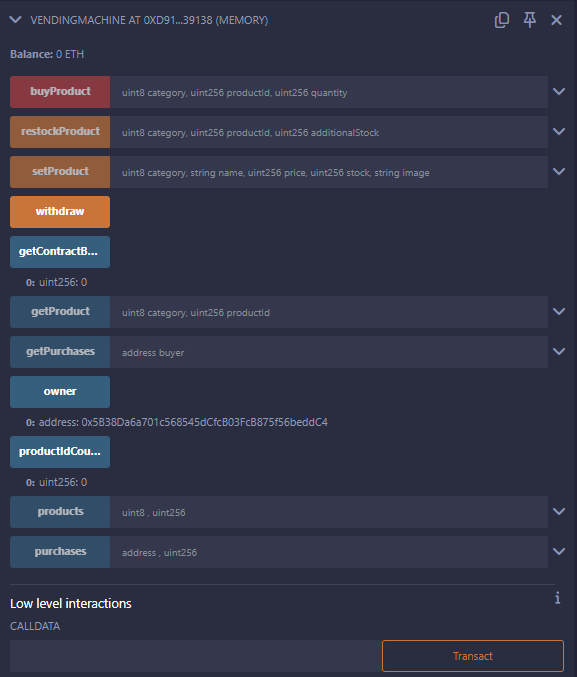

# Vending Machine Smart Contract


## Overview

This Solidity-based smart contract simulates a vending machine that allows users to purchase virtual products from two categories: **DRINKS** and **FOODS**, using Ethereum. The owner can manage product listings, restock inventory, and withdraw Ether from the contract, while users can browse and purchase available items.

## Features

- **Two product categories**: DRINKS and FOODS, each with a name, price, stock, and image.
- **Owner-controlled product management**: Only the contract owner can set products, restock, and withdraw funds.
- **Purchasing products**: Users can buy products by paying the required amount of Ether.
- **Transaction history**: Each purchase is logged for future reference.

## Key Functions

- `setProduct(Category category, string memory name, uint price, uint stock, string memory image)`: Allows the owner to add or update a product in either the DRINKS or FOODS category.
- `restockProduct(Category category, uint productId, uint additionalStock)`: Allows the owner to restock an existing product.
- `buyProduct(Category category, uint productId, uint quantity)`: Allows users to purchase a product if they send the correct amount of Ether.
- `withdraw()`: Allows the owner to withdraw the contract's Ether balance.
- `getProduct(Category category, uint productId)`: Returns details of a product including its name, price, stock, and image.
- `getContractBalance()`: Returns the Ether balance of the contract.

## Usage

1. **Deploy** the contract, which sets the owner.
2. **Add or update a product** (owner only):
   ```solidity
   vendingMachine.setProduct(Category.DRINKS, "Coke", 2 ether, 100, "image_url");
   ```
3. **Restock** a product (owner only):
   ```solidity
   vendingMachine.restockProduct(Category.DRINKS, 0, 50); // Restock 50 units of Coke
   ```
4. **Purchase** a product (any user):
   ```solidity
   vendingMachine.buyProduct{value: 6 ether}(Category.DRINKS, 0, 3); // Buy 3 Cokes for 6 ETH
   ```
5. **Withdraw Ether** (owner only):
   ```solidity
   vendingMachine.withdraw(); // Withdraw all Ether from the contract
   ```
6. **Check product details**:
   ```solidity
   vendingMachine.getProduct(Category.DRINKS, 0); // Get details for Coke
   ```

## Contributors

This project was built with the contributions of the following students:

- **Moses Sabila** – Smart contract implementation, project structuring.
- **Yvette Mukenyi** – Testing and debugging.
- **Nelissa Gitau** – Documentation and project setup assistance.
- **Dave Avina** – Design and integration.